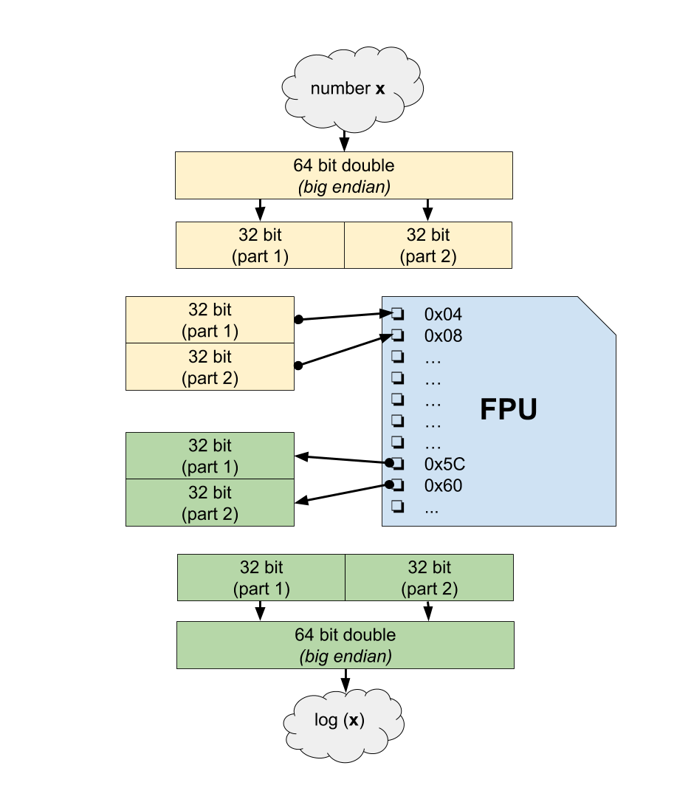

# Relatório do Projeto 3 - Multicore e Aceleração em Hardware


## Integrantes

**Pedro De Nigris Vasconcellos RA:147623**

**Victor Seixas Souza RA:118896**

**Felipe de Oliveira Emos RA:146009**

**Renan Gomes Pereira RA:103927**

**Mateus Bellomo RA:147338**

# Metodologia

Com o intuito de avaliar o ganho de desempenho providenciado pela aceleração em hardware e paralelização através do uso de múltiplos núcleos, escolhemos uma aplicação que, devido ao fato de conter um número elevado de operações envolvendo números com alta precisão --- ***double*** --- e também por ser uma aplicação facilmente dividida em vários processadores, pode tirar vantagem destas otimizações, permitindo uma análise interessante.

A aplicação escolhida foi o algoritmo de Mandelbrot, que consiste em gerar o conjunto de Mandelbrot (basicamente se um ponto pertence ou não ao conjunto) com base em uma janela do plano complexo. Mais informações podem ser encontradas e estudadas no [link][1].

A seguir segue o pseudo-código utilizado em nosso projeto.

```c
	For each pixel (Px, Py) on the screen, do:
	{
  		x0 = scaled x coordinate of pixel (scaled to lie in the Mandelbrot X scale)
  		y0 = scaled y coordinate of pixel (scaled to lie in the Mandelbrot Y scale)
  		x = 0.0
	  	y = 0.0
  		iteration = 0
  		max_iteration = 1000

	  	while ( x*x + y*y < (1 << 16)  AND  iteration < max_iteration ) {
   			xtemp = x*x - y*y + x0
    		y = 2*x*y + y0
    		x = xtemp
			iteration = iteration + 1
  		}
  		
 		// Used to avoid floating point issues with points inside the set.
  		if ( iteration < max_iteration ) {

    		log_zn = log( x * x + y * y ) / 2
    		nu = log( log_zn / log(2) ) / log(2)
    		iteration = iteration + 1 - nu
  		}
  		
	  	color1 = palette[floor(iteration)]
  		color2 = palette[floor(iteration) + 1]
  		
  		// iteration % 1 = fractional part of iteration.
  		
  		color = linear_interpolate(color1, color2, iteration % 1)
  		plot(Px, Py, color)
	}
```

Todas operações de ponto flutuantes estão dentro de um laço, que, em termos de implementação, significa iterar sobre todos os pontos da matriz que correspondem à janela do plano complexo. Desta forma, paralelizamos o algoritmo atribuindo a cada processador um intervalo desta janela, de acordo com o número máximo de processadores.

Para cada pixel --- ponto da matriz --- existe uma série de cálculos executados a fim de determinar a sua cor na figura final. Apesar da matriz que representa estes pontos terem índices inteiros, os pontos de fato devem ser representados por variáveis ***double***, pois muitas vezes a janela na qual estamos calculando o conjunto de Mandelbrot é bem pequena e, por conseguinte, cada ponto no plano é uma fração to comprimento desta janela.

É justamente neste ponto que o periférico de ponto flutuante entra em ação, sendo responsável por otimizar todos estes cálculos para cada pixel em nossa aplicação (soma, subtração, mod, logaritmo).

Definimos o conjunto de experimentos variando o número de processadores ativos (1, 2 e 4) e considerando a aceleração de hardware ou não.

# Implementação

## Periférico de ponto flutuante

O periférico implementado é um periférico acelerador de contas com números complexos. O periférico aceita por vez dois números complexos, cada um com um double para a parte real e um double para a parte imaginária. Uma vez escritos os valores dos dois números, basta ler certos endereços específicos para recuperar os valores de contas feitas com esses números: soma, subtração, módulo, dentre outras operações indicadas na tabela a seguir:

#### Endereços de escrita

<center>

|Addresses|Value|
|:--:|:--:|
|0x04</br>0x08|Re(Z1) part 1</br>Re(Z1) part 2|
|0x0C</br>0x10|Im(Z1) part 1</br>Im(Z1) part 2|
|0x14</br>0x18|Re(Z2) part 1</br>Re(Z2) part 2|
|0x1C</br>0x20|Im(Z2) part 1</br>Im(Z2) part 2|

</center>

Como o MIPS é um simulador 32 bits e a nossa aplicação requer a precisão garantida pelo ***double**, tivemos a necessidade de dividir a parte real e imaginária de cada número (pixel) em duas partes de 32 bits, eis a necessidade de ter dois endereços para a parte real e a parte imaginária. Feito os cálculos, o periférico era encarregado de unir novamente as partes para que a integridade das variáveis se mantessem.

#### Endereços de leitura
|Addresses|Value|Op|Uses Re(Z1)|Uses Im(Z1)|Uses Re(Z2)|Uses Im(Z2)
|:--:|:--:|:--:|:--:|:--:|:--:|:--:|
|0x24</br>0x28</br>0x2C</br>0x30| Re(Zr)</br>Re(Zr)</br>Im(Zr)</br>Im(Zr) | Zr = Z1 + Z2 | YES | YES | YES | YES |
|0x34</br>0x38</br>0x3C</br>0x40| Re(Zr)</br>Re(Zr)</br>Im(Zr)</br>Im(Zr) | Zr = Z1 - Z2 | YES | YES | YES | YES |
|0x44</br>0x48| R</br>R | R = \|Z1\| | YES | YES | NO | NO |
|0x4C</br>0x50</br>0x54</br>0x58| Re(Zr)</br>Re(Zr)</br>Im(Zr)</br>Im(Zr) | Zr = dot( Z1, Z2 )</br>or</br> Zr = Re(Z1)\*Re(Z2) + j\*Im(Z1)\*Im(Z2) | YES | YES | YES | YES |
|0x5C</br>0x60| R</br>R | R = ln( Re(Z1) ) | YES | NO | NO | NO |
|0x64</br>0x68| R</br>R | R= frac( Re(Z1) ) | YES | NO | NO | NO |
|0x6C</br>0x70| R</br>R | R= floor( Re(Z1) ) | YES | NO | NO | NO |
|0x74</br>0x78| R</br>R | R= random[0,1] | NO | NO | NO | NO |
|0x7C</br>0x80</br>0x84</br>0x88| Re(Zr)</br>Re(Zr)</br>Im(Zr)</br>Im(Zr) | Zr = Z1 * Z2 | YES | YES | YES | YES |

Ao invés de instanciar 4 periféricos de ponto flutuante, um pra cada processador, implementamos somente um periférico que contém todos os endereços de cada processador, através de um vetor. Dessa forma, quando o processador quiser acessar um endereço do periférico, basta utilizar o seu identificador (número deste processador) e ter o endereço correspondente.



## Periférico de lock

Este periférico, do exercício 4, foi novamente utilizado a fim de garantir a consistência da aplicação quando existirem mais de um processador ativo. Como já explicamos no exercício 4 as suas funcionalidades, não faremos de novo.


## Instanciação de processadores e periféricos

Várias alterações foram feitas no código ***main.cpp*** do simulador. Primeiramente, ele recebia um arquivo o nome de um arquivo no qual contia os parâmetros de execução de uma determinada simulação (número de processadores, nome do arquivo de saída, número de amostras e o preset da janela do plano complexo).

Dependendo do número de processadores que seriam utilizados em uma execução, ele instancia o número exato de processadores.


```c
	mips mips_proc1("mips1");
  	mips *mips_proc2, *mips_proc3, *mips_proc4;
  	
  	if(nproc > 1){
    	mips_proc2 = new mips("mips2");
  	}
  	if(nproc > 2){
    	mips_proc3 = new mips("mips3");
    	mips_proc4 = new mips("mips4");
  	}
  	
  	...
  	
  	mips_proc1.DM_port(router.target_export);
  	if(nproc > 1){
   		mips_proc2->DM_port(router.target_export);
  	}
  	if(nproc > 2){
   		mips_proc3->DM_port(router.target_export);
    	mips_proc4->DM_port(router.target_export);
  	}

	...
	
	mips_proc1.set_instr_batch_size(1);
  	mips_proc1.init(ac1, av1);
  	if(nproc > 1){
		mips_proc2->set_instr_batch_size(1);
    	mips_proc2->init(ac1, av2);
  	}
  	if(nproc > 2){
		mips_proc3->set_instr_batch_size(1);
    	mips_proc3->init(ac1, av3);
    	mips_proc4->set_instr_batch_size(1);
    	mips_proc4->init(ac1, av4);
  	}
  	
  	...
  	
  	mips_proc1.PrintStat();
  	if(nproc > 1){
    	mips_proc2->PrintStat();
  	}
  	if(nproc > 2){
    	mips_proc3->PrintStat();
    	mips_proc4->PrintStat();
  	}

```

Especificada a instanciação dos processadores, tivemos que instanciar dois periféricos: o de ***ponto flutuante*** o de ***lock***. Mudamos o nome dos periféricos para facilitar a implementação e simplesmente replicamos os passos necessários para a instanciação de um periférico.

```c

	using user::ac_tlm_fpu;
	using user::ac_tlm_lock;	
	
	...

  	ac_tlm_fpu fpu("fpu");
  	ac_tlm_lock lock("lock");
  	
  	...
  
   	router.FPU_port(fpu.target_export);
  	router.LOCK_port(lock.target_export);

```

Alteramos o endereço do periférico de lock para 0x7400000, visto que o periférico de ponto flutuante utiliza endereços a partir do 0x6400000. Outra alteração necessária foi no roteador, no qual tivemos que criar mais uma condição para que ele redirecionasse os endereços requisitados ao periférico correto.

```c

	if((request.addr < 100*1024*1024))
	{
		return MEM_port->transport(request);
	}
	else if ( request.addr == 0x7400000 )
	{
		// Periférico de lock
		return LOCK_port->transport(request);
	}
	else
	{
		// Periférico de ponto flutuante
		return FPU_port->transport(request);
	}

```

# Experimentos

Em todos os experimentos utilizamos uma janela de 40 x 40 pixels (foram testados valores maiores, contudo, as execuções sem aceleração em hardware eram extremamente demoradas).

Para obter um conjunto de dados significativos a respeito da paralelização e da aceleração em hardware desta aplicação, definimos estes 6 experimentos:

|Experimento|Número de processadores|Aceleração em Hardware (S/N)|
|:--:|:--:|:-------:|
|1| 1 | N|
|2| 1 | S|
|3| 2 | N|
|4| 2 | S|
|5| 4 | N|
|6 | 4 | S|

## Experimento 1

	Info: /OSCI/SystemC: Simulation stopped by user.
	ArchC: Simulation statistics
    	Times: 63.53 user, 0.02 system, 63.53 real
    	Number of instructions executed: 890951436
    	Simulation speed: 14024.10 K instr/s
    	
Temos este experimento como a base para todos os outros.
    	    	
## Experimento 2

	Info: /OSCI/SystemC: Simulation stopped by user.
	ArchC: Simulation statistics
    	Times: 6.50 user, 0.00 system, 6.50 real
    	Number of instructions executed: 90919017
    	Simulation speed: 13987.54 K instr/s

	Proc 0: number of c_scalar instructions: 32692
	Proc 0: number of d_log instructions: 5840
	Proc 0: number of c_mult instructions: 1163180
	Proc 0: number of c_mod instructions: 587710
	
Este resultado evidencia a imensa diferença que a aceleração em hardware providencia. Devido ao fato desta aplicação realizar vários cálculos com números de precisão elevada, remover todos esses cálculos da simulação do MIPS e utilizar um periférico no lugar, garante uma redução de quase 90%. Percebe-se que o periférico executa uma grande quantidade de operações (principalmente multiplicações), o que corrobora para o ganho de desempenho.

## Experimento 3

	Info: /OSCI/SystemC: Simulation stopped by user.
	ArchC: Simulation statistics
    	Times: 70.67 user, 0.01 system, 70.74 real
    Number of instructions executed: 452980159
    Simulation speed: 6409.79 K instr/s
	ArchC: Simulation statistics
    	Times: 70.67 user, 0.01 system, 70.74 real
    	Number of instructions executed: 452980192
    	Simulation speed: 6409.79 K instr/s
  
Podemos comparar este experimento com o **Experimento 1**. Percebe-se que aumentar o número de processadores em 1 garante uma redução do número de instruções aproximadamente pela metade, tornando a melhora de desempenho linear em relação ao experimento 1. Como está sendo simulado, o tempo de execução permanece com a mesma ordem, contudo o que importa é o número de instruções executadas por cada processador.


## Experimento 4

	Info: /OSCI/SystemC: Simulation stopped by user.
	ArchC: Simulation statistics
    Times: 6.40 user, 0.00 system, 6.42 real
    Number of instructions executed: 45140166
    Simulation speed: 5490.65 K instr/s
	ArchC: Simulation statistics
    	Times: 6.40 user, 0.00 system, 6.42 real
    	Number of instructions executed: 45140196
    	Simulation speed: 5490.65 K instr/s

	Proc 0: number of c_scalar instructions: 16046
	Proc 0: number of d_log instructions: 2852
	Proc 0: number of c_mult instructions: 721220
	Proc 0: number of c_mod instructions: 363636
	
	Proc 1: number of c_scalar instructions: 16646
	Proc 1: number of d_log instructions: 2988
	Proc 1: number of c_mult instructions: 441960
	Proc 1: number of c_mod instructions: 224074
	
Podemos comparar este experimento com o **Experimento 2 e 3**. Neste percebemos que as instruções foram dividas entre os processadores, semelhante ao **Experimento 2**. Também percebe-se que o número de instruções foram reduzidas novamente em torno de 90% graças à aceleração em hardware.

Outro análise interessante é que o número de operações dos periféricos também foram dividas (embora não pela metade) o que implica que cada processador de fato utilizou seu periférico da maneira correta. Essa divisão não exata é resultado direto dos intervalos que cada processador é responsável. Como o conjunto de Mandelbrot não é simétrico em relação à janela sob a qual está sendo calculado, os intervalos podem exigir mais de um processador que de outro.

## Experimento 5

```
Info: /OSCI/SystemC: Simulation stopped by user
ArchC: Simulation statistics
	Times: 95.88 user, 0.00 system, 95.85 real
   	Number of instructions executed: 469655683
   	Simulation speed: 4898.37 K instr/s
ArchC: Simulation statistics
   Times: 95.88 user, 0.00 system, 95.85 real
   Number of instructions executed: 453478187
   Simulation speed: 4729.64 K instr/s
ArchC: Simulation statistics
   Times: 95.88 user, 0.00 system, 95.85 real
   Number of instructions executed: 469655666
   Simulation speed: 4898.37 K instr/s
ArchC: Simulation statistics
   Times: 95.88 user, 0.00 system, 95.85 real
   Number of instructions executed: 469655701
   Simulation speed: 4898.37 K instr/s
```

Este experimento, quando comparado ao **Experimento 3** não está de acordo com o esperado. O número de instruções de cada processador aumenta em torno de 0,03%. O que esperávamos era que o número fosse reduzido ainda pela metade. O problema pode derivar do modo como estamos usando as funções de ***AcquireLock()*** e ***ReleaseLock()***.

## Experimento 6

```
Info: /OSCI/SystemC: Simulation stopped by user
ArchC: Simulation statistics
    Times: 19.06 user, 0.00 system, 19.06 real
    Number of instructions executed: 55581703
    Simulation speed: 4647.52 K instr/s
ArchC: Simulation statistics
    Times: 19.06 user, 0.00 system, 19.06 real
    Number of instructions executed: 55337560
    Simulation speed: 4739.64 K instr/s
ArchC: Simulation statistics
    Times: 19.06 user, 0.00 system, 19.05 real
    Number of instructions executed: 55791484
    Simulation speed: 4553.59 K instr/s
ArchC: Simulation statistics
    Times: 19.06 user, 0.00 system, 19.05 real
    Number of instructions executed: 55705362
    Simulation speed: 2712.77 K instr/s


Proc 0: number of c_scalar instructions: 9766
Proc 0: number of d_log instructions: 550
Proc 0: number of c_mult instructions: 284310
Proc 0: number of c_mod instructions: 138726

Proc 1: number of c_scalar instructions: 7288
Proc 1: number of d_log instructions: 764
Proc 1: number of c_mult instructions: 398034
Proc 1: number of c_mod instructions: 208090

Proc 2: number of c_scalar instructions: 2617
Proc 2: number of d_log instructions: 1760
Proc 2: number of c_mult instructions: 165805
Proc 2: number of c_mod instructions: 114711

Proc 3: number of c_scalar instructions: 13021
Proc 3: number of d_log instructions: 2816
Proc 3: number of c_mult instructions: 315031
Proc 3: number of c_mod instructions: 126183

```

Algo parecido com o que ocorreu no **Experimento 5** ocorre aqui. Quando comparado ao **Experimento 4**, percebemos um aumento do número de instruções de cada processador, quando o esperado era que fosse pelo menos metade. No entanto, percebemos que a acelereção em hardware funciona, pois o número de instruções também apresenta uma redução em torno de 90% em relação ao **Experimento 5**. 


# Conclusão

Antes de implementarmos a aceleração em hardware e considerar vário núcleos rodando na mesma aplicação, estimamos um ganho de desempenho linear em relação ao número de processadores ativos (ou seja, o número de instruções divida igualmente entre o número de núcleos ativos) e um ganho incerto, porém considerável, em relação à aceleração em hardware.

Após os testes, percebemos que, em certa extensão, uma das nossas expectativas estava correta. O ganho de desempenho a respeito da paralelização providenciada pelo número de processadores ativos de fato foi linear até 2 processadores (com ou sem aceleração em hardware), vide a forma pela qual o número de instruções eram reduzidas de acordo com a quantidade de processadores. Quando consideramos 4 processadores, o número de instruções de cada um sofreu um aumento em torno de 0,03%, que pode ser consequência direta do modo que estamos usando as funções que tratam as trancas do programa.

No entanto, o ganho providenciado pela aceleração em hardware foi extremamente relevante, superando nossas expectativas. Para cada pixel da janela, existe uma quantidade grande de operações, ainda mais quando consideramos este pixel um número complexo de 64 bits. O periférico de ponto flutuante garante uma aceleração em torno de 90% (como não foram consideradas a influência dos pesos de cada instrução, esta aceleração pode sofrer uma redução).

Também é valido notar que a soma do número de operações executadas por todos periféricos é constante. Isto ocorre pois a janela sob a qual estamos executando o programa é a mesma em todos os experimentos, então, dependendo da divisão dos intervalos, cada processador pode realizar menos ou mais cálculos e, consequentemente, os seus respectivos periféricos.

[1]: https://pt.wikipedia.org/wiki/Conjunto_de_Mandelbrot
